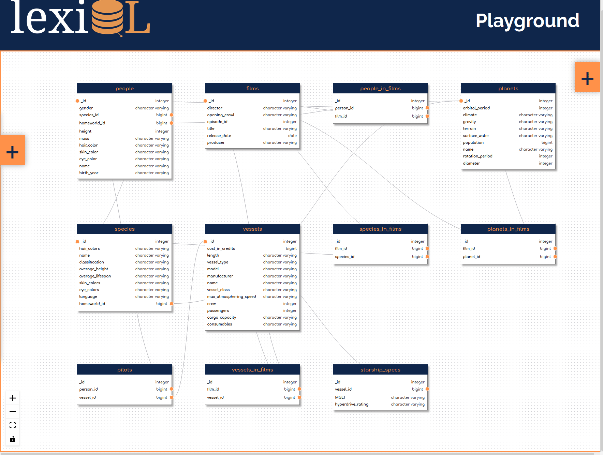
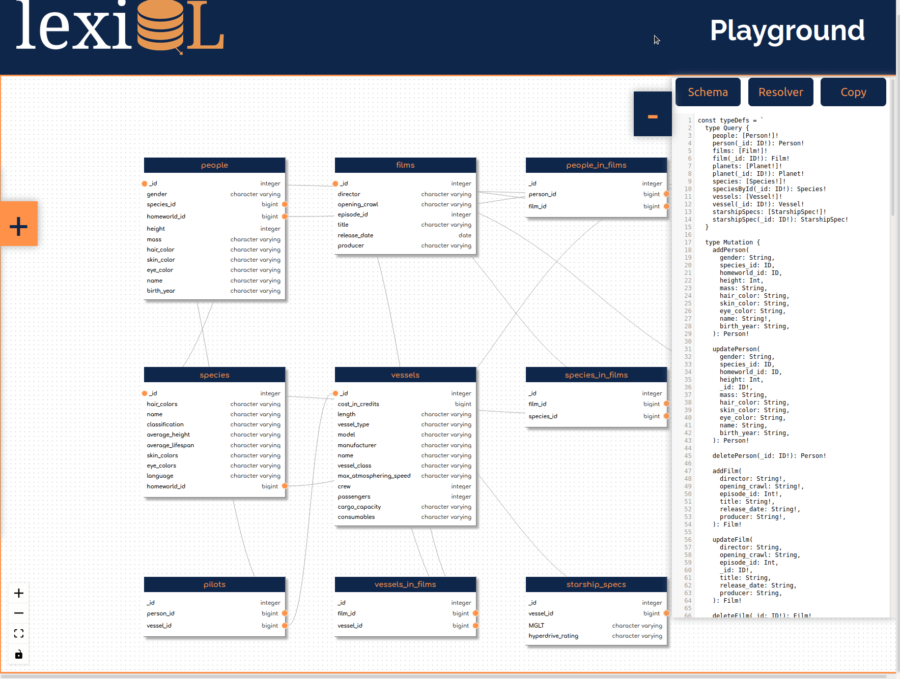

# lexiQL

<i>lexiQL</i> is an open-source GraphQL prototyping tool that visualizes your relational database and facilitates GraphQL API prototyping and configuration, allowing developers to to optimize their queries and transition away from RESTful APIs. The tool takes a relational database input and uses it to generate the respective GraphQL schemas alongside an interactive GUI that displays all of the tables in a database, including primary/foreign key relationships between tables, as well as each table’s columns and associated data types. 

## Getting Started
Visit www.lexiql.io to utilize the tool.

#### Select your database
  1. [ ] Input your PostgreSQL URI
  2. [ ] OR use the sample database to view data rendered in an interactive diagram.

#### View your relational database
  1. [ ] Easily view the relationships between the tables via the links that highlight the foreign key constraints.
  2. [ ] Move any table and arrange them to optimally view the structure of the database and the relationships between the tables.

#### View your GQL schema
  1. [ ] View the generated GraphQL schema, including the types and associated resolvers.
  2. [ ] Use the copy button to effortlessly integrate the code into your project.

#### View your GQL schema
  1. [ ] Interactively construct full queries using the sample database.
  2. [ ] Use the "Docs" to explore the possible queries, fields, types, mutations, and more.

## Developers
* Christopher Carney – [@Carthanial](https://github.com/Carthanial)  
* Stacy Learn – [@hello-stacy](https://github.com/hello-stacy)   
* John Li – [@john-li7](https://github.com/john-li7)   
* Ryan McDaniel – [@ryanmcd118](https://github.com/Cryanmcd118) 

## License 
This product is licensed under the MIT License.

